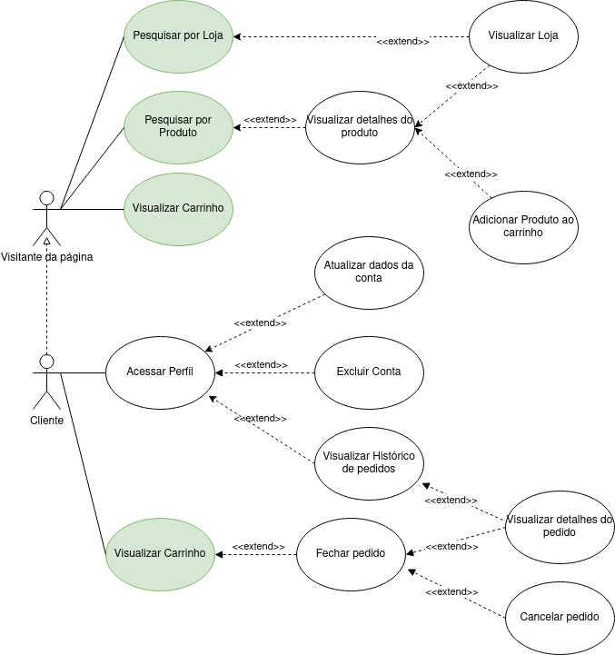
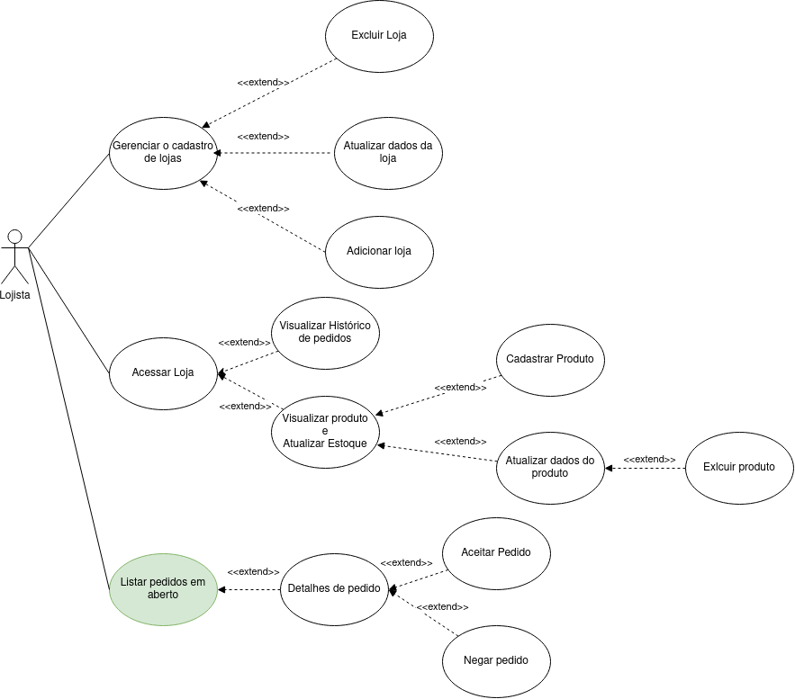

# Diagrama de caso de uso

## Sobre o Drawio

### Esse diagrama foi feito no [Draw.io](https://app.diagrams.net/), sendo assim, para interagir com o diagrama, é necessário ou fazer o download da extensão [Draw.io](https://app.diagrams.net/) pelo Visual Studio Code, caso esteja utlizando esse editor, ou fazer o download do arquivo e abrir no proprio [Draw.io](https://app.diagrams.net/).

### Além disso, essa ferramenta é bem simples de usar e é bastante intuitiva.

## O Diagrama

