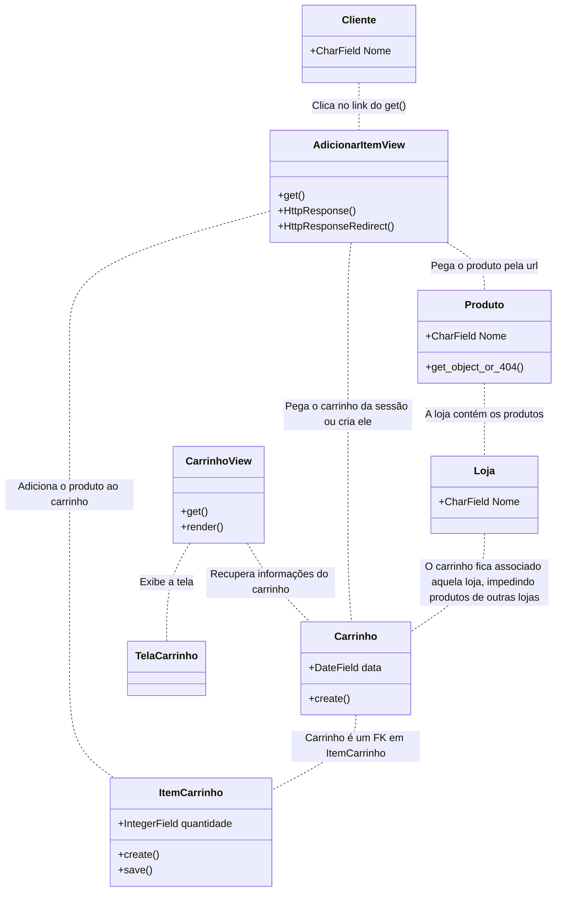

```mermaid

classDiagram

    class ItemCarrinho{
        +IntegerField quantidade
        +create()
        +save()
    }

    class Carrinho{
        +DateField data
        +create()
    }

    class Cliente{
        +CharField Nome
    }

    class Loja{
        +CharField Nome
    }

    class Produto{
        +CharField Nome
        +get_object_or_404()
    }

    class AdicionarItemView{
        +get()
        +HttpResponse()
        +HttpResponseRedirect()
    }

    class CarrinhoView{
        +get()
        +render()
    }


    Cliente .. AdicionarItemView : Clica no link do get()
    AdicionarItemView .. Produto : Pega o produto pela url
    AdicionarItemView .. Carrinho : Pega o carrinho da sessão ou cria ele
    AdicionarItemView .. ItemCarrinho : Adiciona o produto ao carrinho
    Carrinho .. ItemCarrinho : Carrinho é um FK em ItemCarrinho
    CarrinhoView .. Carrinho : Recupera informações do carrinho
    CarrinhoView .. TelaCarrinho: Exibe a tela
    Produto .. Loja : A loja contém os produtos
    Loja .. Carrinho: O carrinho fica associado aquela loja, impedindo produtos de outras lojas


```
