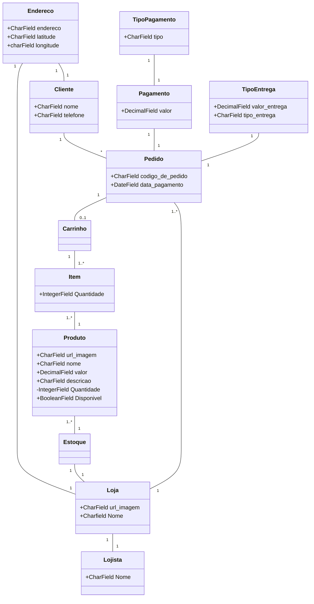

```mermaid
classDiagram


    class Endereco{
        +CharField endereco
        +CharField latitude
        +charField longitude
    }
    class Cliente{
        +CharField nome
        +CharField telefone
    }

    class Item{
        +IntegerField Quantidade
    }
    class Produto{
        +CharField url_imagem
        +CharField nome
        +DecimalField valor
        +CharField descricao
        -IntegerField Quantidade
        +BooleanField Disponivel
    }

    class Pedido{
        +CharField codigo_de_pedido
        +DateField data_pagamento
    }

    class TipoEntrega{
        +DecimalField valor_entrega
        +CharField tipo_entrega
    }

    class Lojista{
        +CharField Nome
    }

    class Loja{
        +CharField url_imagem
        +Charfield Nome 
    }

    class TipoPagamento{
        +CharField tipo
    }

    class Pagamento{
        +DecimalField valor
    }

    Endereco "1" -- "1" Cliente
    Endereco "1" -- "1" Loja
    Pedido "1" -- "0..1" Carrinho
    Cliente "1" -- "*" Pedido
    Carrinho "1" -- "1..*" Item
    Item "1..*" -- "1" Produto
    Produto "1..*" -- "1" Estoque
    Estoque "1" -- "1" Loja
    Loja "1" -- "1..*" Pedido
    Pagamento "1" -- "1" Pedido
    TipoPagamento "1" -- "1" Pagamento
    TipoEntrega "1" -- "1" Pedido
    Loja "1" -- "1" Lojista


    
    
   

   
```
