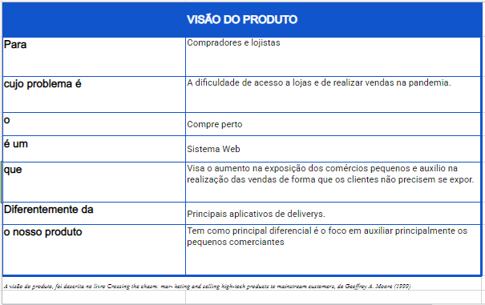

# Visão do produto

O projeto Compre Perto é um sistema web destinado a compradores e lojistas, cujos problemas são a dificuldade de acesso a lojas e de realizar vendas, respectivamente, no período da pandemia, o qual ocasionou diminuição da presença dos clientes, fazendo haver uma redução no lucro do comércio, obrigando até em casos extremos o fechamento do mesmo. Diferentemente dos principais aplicativos de delivery que existem, o nosso principal diferencial é o foco em auxiliar principalmente os pequenos comerciantes de forma gratuita, porém havendo custeamento apenas para futuros patrocinadores, isto aumentará a exposição destes comércios e irá auxiliar na realização das vendas de produtos em geral, de forma que os clientes não precisem se expor. A visão foi alterada de servirmos apenas como um pesquisador de lojas para sermos intermediadores de todas as compras, porém não sendo responsabilizado pela transação financeira.
 
   
  
